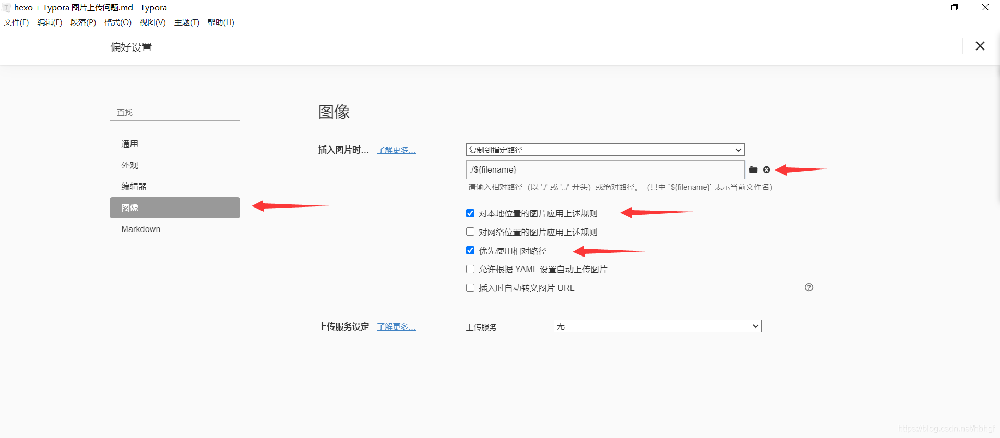

enable_shared_from_this允许一个对象从this指针获取另外一个shared_ptr对象，当然这个对象必须被一个shared_ptr管理。

<!--more-->

### 场景

主要场合是在回调函数中，例如以下代码，Factory负责创建一些对象，这些对像在退出时对调用Factory的do_some_wor()函数。因此Factor的生命周期应该长于T，为了这个目的，T应该保存一个shared_ptr<Factory>的变量。





```c++
class Factory : public enable_shared_from_this<Factory>{
public:
	T create_some_objiect() {
     	return T([factory = shared_from_this()](){
            factory.do_some_work();
        }); 
    }
};
```

### 源码

```c++
// shared_ptr.h

template<typename _Tp>
class enable_shared_from_this
{
protected:
  constexpr enable_shared_from_this() noexcept { }
  enable_shared_from_this(const enable_shared_from_this&) noexcept { }
  enable_shared_from_this&
  operator=(const enable_shared_from_this&) noexcept
  { return *this; }
  ~enable_shared_from_this() { }
public:
  shared_ptr<_Tp>
  shared_from_this()
  { return shared_ptr<_Tp>(this->_M_weak_this); }
  shared_ptr<const _Tp>
  shared_from_this() const
  { return shared_ptr<const _Tp>(this->_M_weak_this); }

private:
  template<typename _Tp1>
  void
  _M_weak_assign(_Tp1* __p, const __shared_count<>& __n) const noexcept
  { _M_weak_this._M_assign(__p, __n); }

  // Found by ADL when this is an associated class.
  friend const enable_shared_from_this*
  __enable_shared_from_this_base(const __shared_count<>&,
  const enable_shared_from_this* __p)
  { return __p; }

  template<typename, _Lock_policy>
  friend class __shared_ptr;

  mutable weak_ptr<_Tp>  _M_weak_this;
};
```

上述代码来自gcc，可以看到enable_shared_from_this类通过weak_ptr<_Tp>管理对象。但是奇怪的是，构造函数并没有对`_M_weak_this`进行赋值。`_M_weak_this`的构造实在shared_ptr对象构造时赋值的。

```c++
// shared_ptr_base.h
class __shared_ptr{
    __shared_ptr(_Yp* __p) {
        _M_enable_shared_from_this_with(__p);
    }
    // 继承了enable_shared_from_this
    _M_enable_shared_from_this_with(_Yp* __p) noexcept
	{
	  if (auto __base = __enable_shared_from_this_base(_M_refcount, __p))
	    __base->_M_weak_assign(const_cast<_Yp2*>(__p), _M_refcount);
	}
	// 如果没有继承enable_shared_from_this
	_M_enable_shared_from_this_with(_Yp*) noexcept
	{ }
};
```

在shared_ptr构造时，会调用`_M_enable_shared_from_this_with`，如果对象继承了`enable_shared_from_this`那么会调用`__enable_shared_from_this_base`和`_M_weak_assign`创建_M_weak_this。值得注意的是，shared_ptr_base.h 中定义了一个__enable_shared_from_this，这个类与enable_share_from_this除了名字外几乎一模一样。

### 总结

​	enable_shared_from_this的构造函数没有赋值`_M_weak_this`。原因主要为，如果是一个栈对象，enable_shared_from_this是不适用的。只有当该对象被一个shared_ptr管理时，在创建share_ptr对象时，赋值`_M_weak_this`。

### 问题

- `_M_weak_this`为什么要用cosnt修饰？
- __enable_shared_from_this_base为什么要声明为friend，明明没有访问到enable_shared_from_this的私有成员？
- _M_enable_shared_from_this_with 调用__enable_shared_from_this_base时，发生了`__p`类型从`_Yp*`到`enable_shared_from_this*`的隐式转换，这是如何实现的？


