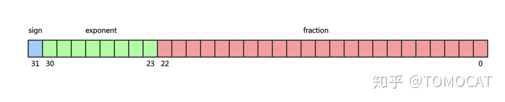

最近在学习CUDA，发现不同的计算方法或不同的数据类型，同一问题的结果可能会有不一样的结果，这主要归因于浮点数的精度。因此再次整理浮点数相关的知识，包括浮点数的表示、精度和比较等。

<!--more-->


## 1. 十进制二进制相互转换

我们知道对于一个10进制的整数，要想得到其二进制的表示，可以**除2取余，逆序排列**的方法。而对于一个浮点数，要想得到其二进制表示则需要分为两步：1）整数部分采用**除2取余，逆序排列**的方法；2)小数部分则采取**乘2取整，顺序排列**的方法。
	
  我们来看一下其原理。对于一个给定的10进制数**i**，其对应的二进制表示为：
$$
d_m d_{m-1} \cdots d_1 d_0 \cdot d_{-1} d_{-2} \cdots d_{-n}
$$
  其中**d**为[0, 1]，现在我们要找到对应的**d**序列。首先可以明确一点的是，对于一个正整数，无论是十进制还是二进制都是可以精确表示的，因为基地都是1.然而对于小数部分就不一定的了，十进制的基底为$ \frac{1}{10}, \frac{1}{100},\frac{1}{1000}... $，而二进制为$ \frac{1}{2}, \frac{1}{4}, \frac{1}{8}... $，这些基底并不能表示任意粒度，所以并不能精度地表示每一个实数。
	

有点扯远了，还是看看转换吧。整数部分的**除2取整**法实际上就是通过右移序列，从左到右得到每一个位二进制。而小数部分则是左移是的小数分别大于零而得到每一位。

## 2. IEEE 754浮点数


在IEEE 754的标准规定：

- 一个浮点数分为三个部分：符号位S、指数部分E和尾数部分M。其中，float32的指数为8位，位数23位。double64的指数为11位，尾数52位。
- 当阶码不全部为0或者1时，这个数是规格化的。规格化的尾数第一位一定为1，因此省略了。阶码表示的值为$E - (2^{k-1}-1)$，k为价码为数。
- 当价码全部为0时，这个数是非规格化的。阶码的值为$ 1 - (2^{k-1}-1) $，尾数不包含默认的1。置于是1-的原因主要是便于从非规格化到规格化的转换。具体参考[1]
- 当阶码全为1时，表示特殊值。当小数全为0时，表示$\pm \infty$。当小数部分为非全0时，表示NaN。
- 舍入。这个还是不太清楚，但大概是就近舍入，如果是中间值则向偶数舍入。这里指得是二进制数。
- 运算。对于加减运算，首先需要进行对价。

## 3.误差来源

- 首先，二进制无法精确表示每一个十进制数，比如0.1等。
- 浮点数在进行加减运算时需要先对价，这可能会使较小的那个浮点数变为0.**浮点数运算不符合结合律和分配律**，这一点与加法的性质相悖。

## 4. 浮点数比较

这里主要参考了[Bruce Dawson的浮点系列博客](https://randomascii.wordpress.com/2012/02/25/comparing-floating-point-numbers-2012-edition/)[2]，这个系列讨论了很多关于浮点数的问题，有时间要看完。

### 4.1 为什么不能直接使用==比较两个浮点数

| **Number** | **Value**                                                  |
| ---------- | ---------------------------------------------------------- |
| 0.1        | 0.1 (of course)                                            |
| float(.1)  | 0.100000001490116119384765625                              |
| double(.1) | 0.10000000000000000555111512312578270211815834045 41015625 |

可以看到float与double精度相差过大，**0.1f != 0.1**。

### 4.2 阈值比较 Epsilon comparison

如果两个浮点数相差小于一定阈值时，可以认为两个浮点数相等：

$$ bool isEqual = fabs(f1 – f2) <= epsilon; $$

epsilon的选择大多数时候是基于经验的，对于float可以选择为1.19e-7f，这也是< float.h>中的**FLT_EPSILON**，为1.0与下一个浮点数的差值，也即$2^{-23}$。

当浮点数位于[1, 2]之间时，使用**FLT_EPSILON**是不错的选择，但大于2时，这个值又显得比较小，有时候差值全部都大于**FLT_EPSILON**，这样一来这个比较就没有意义。而对于小于1的数，**FLT_EPSILON**有可能比浮点数还要大。因此更为理智的办法是基于比例。

### 4.3 比例比较法Relative epsilon comparisons

比较两个数的差，计算差与较大的数的比值。从代码看为：

```c
bool AlmostEqualRelative(float A, float B,
                         float maxRelDiff = FLT_EPSILON)
{
    // Calculate the difference.
    float diff = fabs(A - B);
    A = fabs(A);
    B = fabs(B);
    // Find the largest
    float largest = (B > A) ? B : A;

    if (diff <= largest * maxRelDiff)
        return true;
    return false;
}
```

本质上，比例法主要是确保了浮点数的精度要求。如果使用FLT_EPSILON，则则要求float有22位精度。

### 4.4 ULP比较法 (Unit in the last place)

​	浮点数所能表示的值都是离散的，相邻的浮点数的整数表示也是相邻的（即将二进制当成整数解释）。ULP是指浮点数最后一位的精度，IEEE 754规定舍入时带来的误差必须小于等于0.5ULP。相邻的浮点数相差一个ULP。

​	基于以上认识，我们可以通过整数表示的差值比较浮点数的大小：两个相**同符号**的浮点数，如果整数表示只相差1，那么这两个浮点数相当接近。要求相同符号的原因为：不同符号的浮点数整数表示相差非常大；可能会发生溢出。

​	实质上，ULP比较法是比例法的一个更为优雅高效的实现。

```c++
#include <stdint.h> // For int32_t, etc.

union Float_t
{
    Float_t(float num = 0.0f) : f(num) {}
    // Portable extraction of components.
    bool Negative() const { return i < 0; }
    int32_t RawMantissa() const { return i & ((1 << 23) - 1); }
    int32_t RawExponent() const { return (i >> 23) & 0xFF; }

    int32_t i;
    float f;
#ifdef _DEBUG
    struct
    {   // Bitfields for exploration. Do not use in production code.
        uint32_t mantissa : 23;
        uint32_t exponent : 8;
        uint32_t sign : 1;
    } parts;
#endif
};

bool AlmostEqualUlps(float A, float B, int maxUlpsDiff)
{
    Float_t uA(A);
    Float_t uB(B);

    // Different signs means they do not match.
    if (uA.Negative() != uB.Negative())
    {
        // Check for equality to make sure +0==-0
        if (A == B)
            return true;
        return false;
    }

    // Find the difference in ULPs.
    int ulpsDiff = abs(uA.i - uB.i);
    if (ulpsDiff <= maxUlpsDiff)
        return true;
    return false;
}
```

### 4.5 ULP versus FLT_EPSILON

​	ULP与FLT_EPSILON比例法在**不同的数据范围内有不同的效果**，大部分情况下两者的结果是一样的。当浮点数大于4时，两者一致；当小于4时，两者不一样。比如4.0与4.0+2ULPs在两种方法下都一样。当4.0与4.0-2ULPs，则不一样。ULP方法认为两个数不相等，而FLT_EPSILON则认为相等。

​	在性能方面，因为ULP将float解释为int，因此可以使用SSE指令进行加速。但是也可能会造成流水线停顿，因为需要将数据从浮点寄存器搬移到整数寄存器。

​	还有一些特殊情况需要注意：

- FLT_MAX to infinity – one ULP, infinite ratio
- zero to the smallest denormal – one ULP, infinite ratio
- smallest denormal to the next smallest denormal – one ULP, two-to-one ratio
- NaNs – two NaNs could have very similar or even identical representations, but they are not supposed to compare as equal
- Positive and negative zero – two billion ULPs difference, but they should compare as equal
- As discussed above, one ULP above a power of two is twice as big a delta as one ULP below that same power of two

### 4.6 与零比较

​	当浮点数在0附近时，ULP与FLT_EPSILON方法都不使用，反而是绝对值误差使用。文章后面讨论了许多关于方法选择的问题，这里就不一一介绍了。简单总结下就是：

- 如果两个数都接近于0，那么使用绝对值判断。
- 如果两个数都大于0，那么使用ULP和FLT_EPSILON相对法。
- 如果两个数既可以接近0，也可以大于0，那么看运气吧。

** 不得不说这是个好文章，大部分内容都是我不知道的，更加是没考虑过的。后面有时间一定要看看其它的文章**


## 参考

- [1] 深入理解计算机系统：2.4.
- https://randomascii.wordpress.com/2012/02/25/comparing-floating-point-numbers-2012-edition/

